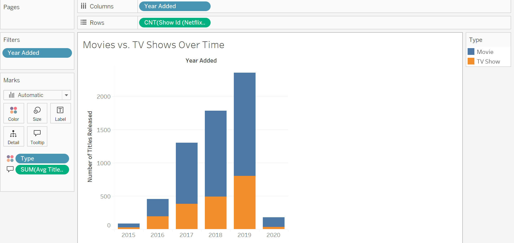
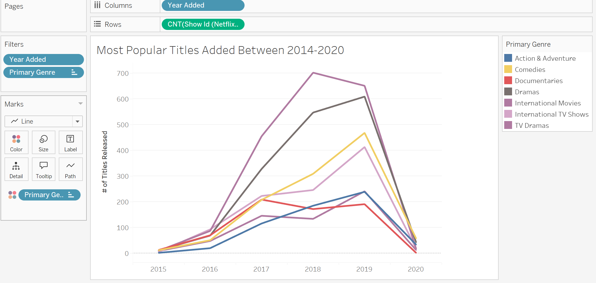
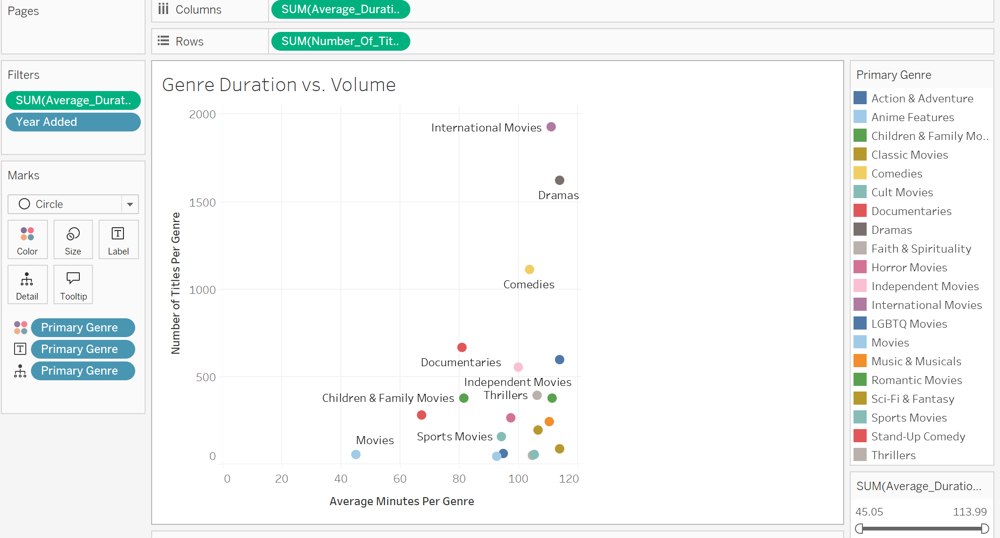
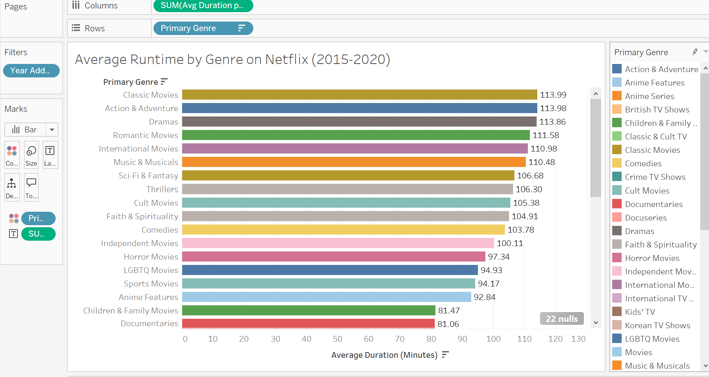
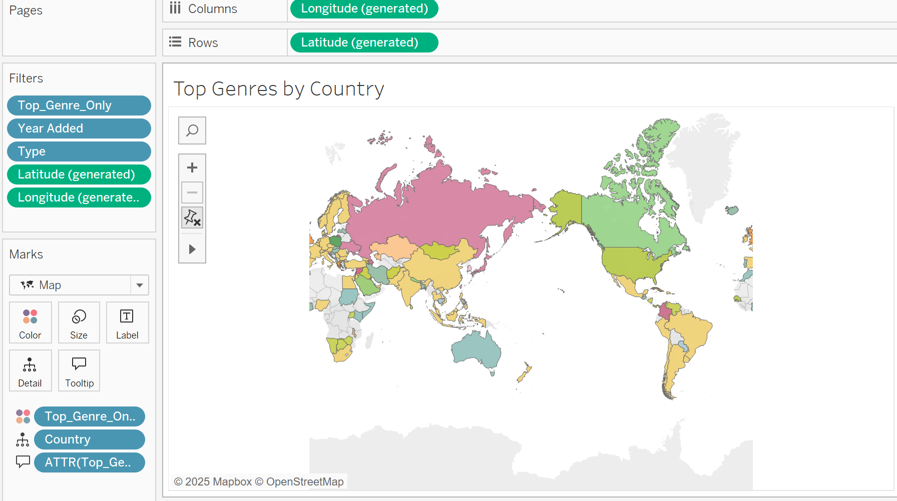

# Netflix Content Strategy Analysis

## Project Overview
This project analyzes Netflix content trends from 2015–2020 using Tableau to explore how the platform’s content strategy evolved over time. The analysis focuses on genre popularity, content distribution, release trends, and differences between Movies and TV Shows to identify business and consumer viewing patterns.

## Business Problem
Streaming platforms rely heavily on viewer engagement and content strategy to remain competitive. This project was designed to examine how Netflix adjusted its content offerings over time and how genre trends may influence audience engagement and future business decisions.

## Tools & Technologies
- Tableau
- Microsoft Excel
- Data Visualization
- Business Analytics
- Dashboard Design
- Exploratory Data Analysis (EDA)

## Key Areas of Analysis
- Movies vs. TV Shows growth trends
- Genre popularity over time
- Content release distribution
- Average movie duration by genre
- Most common content categories
- Strategic shifts in Netflix programming between 2015–2020

## Key Insights
- Netflix significantly increased TV Show releases between 2018–2020.
- Drama and Comedy remained among the platform’s most dominant genres.
- Content strategy shifted toward globally diverse and serialized content.
- Visualization dashboards helped identify trends that may support future content investment decisions.

## Dashboard Visualizations

### Movies vs TV Shows Over Time
Visualization showing Netflix’s rapid increase in both movie and TV show releases between 2015–2020, with especially strong growth in serialized TV content.



---

### Genre Trends Over Time
Line chart highlighting growth trends among Netflix’s most popular genres across multiple years.



---

### Genre Duration vs Volume
Scatterplot comparing average runtime and content volume across major Netflix genres.



---

### Average Runtime by Genre
Visualization analyzing average movie runtimes across Netflix genres between 2015–2020.



---

### Top Genres by Country
Geographic visualization showing dominant Netflix genres across different countries and regions.



## Repository Structure
```text
images/               -> Dashboard screenshots and visualizations
report/               -> Executive summary and written report
tableau-workbook/     -> Tableau workbook files
```

## Future Improvements
Future versions of this project could incorporate:
- Viewer rating analysis
- Predictive trend forecasting
- Sentiment analysis from audience reviews
- Regional content performance comparisons

## Author
Cruz Lawrence-Mayes  
M.S. Data Analytics
